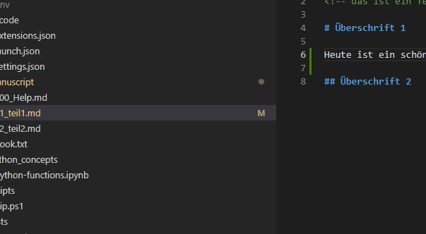

# Teil 1: Ziele #
<!-- das ist ein Teil-->

# Überschrift 1

Heute ist ein schöner Tag.


{width: "60%"}
  

## Überschrift 2


{title: "Wahnsinnig schönes gameboard.", id: gb-1}
```text
 --- --- --- --- --- 
|   |   |   |   |   |
 --- --- --- --- --- 
|   |   |   |   |   |
 --- --- --- --- --- 
|   |   |   |   |   |
 --- --- --- --- --- 
|   |   |   |   | o |
 --- --- --- --- --- 
|   | o | o | o | o |
 --- --- --- --- --- 
```