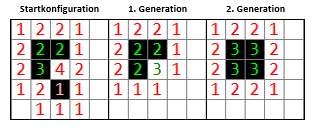
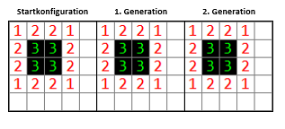
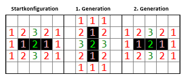
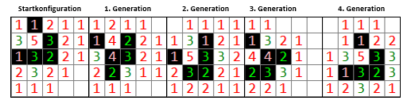
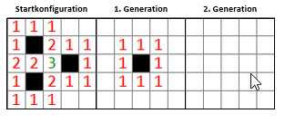

# Einleitung

## John Conway
John Horton Conway ist ein bedeutender Mathematiker aus dem 20. Jahrhundert. Er wurde 1937 in Liverpool geboren und verstarb vor zwei Jahren im Alter von 82 Jahren an Covid-19. Er studierte Mathematik an der Universität Cambridge, wo er später mathematische Logik unterrichtete. Während dieser Zeit machte er sich einen Namen in dem Gebiet der Gruppentheorie. Er entdeckte eine endliche Gruppe mit über 8 Trillionen Elementen in einem 24-dimensionalem Raum, die nach ihm benannt wurde. (*Strick* 2022)

Ihm war es wichtig, die Mathematik den Leuten näherzubringen. Dadurch unterrichtete er nicht nur Hochbegabte an Universitäten, sondern auch jüngere und durchschnittlich-talentierte Kinder. Er gab viele Vorträge, bei denen er entweder gänzlich vom Thema abkam, oder gar nicht erst erschien. Er bezeichnete sich selbst als faul und ging stets barfuss oder in Sandalen. Er entsprach also genau dem Bild, das die Allgemeinheit von einem zerstreuten Professor hat. (*Szpiro* 2020)

{width: "30%"}
 

Schon als Kind hatte er eine Faszination für Spiele, welche ihn später in die Unterhaltungsmathematik führte. Er war eine der ersten Personen, die eine Theorie zur Lösung des "Rubik's Cube" veröffentlichte. Ausserdem konnte er dank einer selbst entwickelten Methode innerhalb von Sekunden den Wochentag beliebiger Daten ausrechnen. Er wurde von seinen Kollegen "Mathemagier" genannt. (*Strick* 2022)

Der Öffentlichkeit wurde er durch die Entwicklung des "Game of Life" bekannt. Dieses "no-player, never ending game", wie er es auch nannte, entwickelte er in den 70er Jahren. Das Spiel war der Startschuss für Simulationen auf dem Gebiet der Komplexitätswissenschaft. Ganze Generationen von Mathematikern, Informatikern und Tüftlern liessen sich dafür begeistern. Die ansteigende Popularität seiner Entwicklung gefiel Conway gar nicht, weshalb er Fragen über seine Kreation mit dem Satz "I hate life" auswich. Gegen das Ende seines eigenen Lebens konnte er sich jedoch wieder mit seiner Rolle als Schöpfer des "Game of Life" anfreunden: 

> "Ich gab irgendwo einen Vortrag und wurde als 'John Conway, Schöpfer des Lebens.' vorgestellt. Und ich dachte 'Oh das ist eine nette Art, bekannt zu sein'." [^footnote-1]
>
> - *John Conway*

Die Faszination des Spieles liegt darin, dass ein einfaches Konzept mit vier simplen Regeln hochkomplexe Themen behandelt. Wie der Musiker Brian Eno sagte:

> "Wir sind an die Idee gewöhnt, dass alles Komplexe aus etwas noch Komplexerem hervorgehen muss. […] Life zeigt uns komplexe, virtuelle Organismen, erschaffen durch die Interaktion mit ein paar einfachen Regeln." 
> 
> - *Brian Eno* [*Roberts* 2020](#Roberts)

[^footnote-1]: Zitate wurden von mir aus dem Englischen übersetzt.

## Regeln

Das "Game of Life" ist ein faszinierendes Spiel, welches auf vier einfachen Regeln basiert. Man stelle sich ein Schachbrett vor, welches über eine beliebig grosse Anzahl an Feldern verfügt. Jedes Feld, oder besser, jede Zelle kann entweder lebendig oder tot sein. Durch die Abhängigkeit von ihren Nachbarn kann sich der Status der Zelle von Generation zu Generation verändern. Jede Zelle hat acht Nachbarn, drei oben, drei unten und noch je einen auf jeder Seite. Zu Beginn kann der Zustand jeder Zelle festgelegt werden. Nun gelten folgende Regeln:

1.	Der Status einer Zelle bleibt unverändert, wenn diese zwei Nachbarn hat.
2.	Hat die Zelle drei Nachbarn, ist diese zwingend am Leben.
3.	Wenn weniger als zwei Nachbarn leben, stirbt eine lebendige Zelle an Einsamkeit.
4.	Hat sie mehr als drei Nachbarn, stirbt sie an Überbevölkerung.

[*Sedlacek* 2021](#Sedlacek)

{width: "50%"}
  

Die Zahlen auf der Abbildung zeigen an, wie viele Nachbarn die betroffene Zelle hat. Wenn die Zahl grün geschrieben ist, fängt die Zelle in der nächsten Generation an zu leben oder bleibt am Leben.

## Objekte   

Über die Jahre wurden viele unterschiedliche Objekte entdeckt. Diese können in verschiedene Kategorien eingeteilt werden:

- statische Objekte
- oszillierende Objekte
- gleitende Objekte
- selbst auslöschende Objekte

Daneben gibt es noch weitere Objektklassen, die in dieser Arbeit nicht konkret berücksichtigt werden:

- Gleiterkanonen erzeugen in einem periodischen Zeitabstand immer wieder Gleiter
- Puffer stellen eine Art gleitendes Objekt mit Überbleibsel dar
- Völlig chaotische Objekte. Diese Objekte beinhalten viele verschiedene Objekte und können nicht klar zugeordnet werden.

### Statische Objekte

Statische Objekte, oft auch "Stillleben" genannt, definieren sich dadurch, dass sie sich beim Spielen nicht verändern. Dies ist möglich, wenn jede lebende Zelle zwei oder drei Nachbarn hat, aber keine der toten Zellen genau drei.
Die zweite Generation des vorherigen Beispiels ist ein statisches Objekt:

{width: "50%"}
  

### Oszillierende Objekte

Oszillatoren ändern sich, einem bestimmten Schema folgend, in periodischen Zeitabständen. Hierbei ändern sie ihren Standort nicht, sondern verhalten sich stationär.

{width: "50%"}
  

### Gleitende Objekte

Wie auch die Oszillatoren verändern sich diese Objekte periodisch nach einem bestimmten Schema. Der Unterschied liegt aber darin, dass sie ihre Position ändern. Auf einem endlosen Spielfeld hören sie also nie auf, sich fortzubewegen.

{width: "85%"}
  

### Selbst auslöschende Objekte

Diese Objekte enden nach `n`$ Generationen in einem leeren Spielfeld

{width: "50%"}
    

(*Johnston* 2023)[#Johnston]

## Probleme

Die Anwendung des "Game of Life" ist für viele Themenbereiche interessant. So in der Biologie, wo das Spiel als ein Blick ins Mikroskop interpretiert werden kann. Das Interesse liegt also auf den verschiedenen Lebensformen und der Entwicklung von Zellen. Auch vertritt das Konzept einen ökonomischen Aspekt, wobei das Sterben und Gebären der Zellen das Angebot und die Nachfrage auf einem Finanzmarkt darstellen. Weiter ist das Spiel für die Physik interessant. Hierbei liegt das Augenmerk darauf, dass auf beliebig kleine Abweichungen der Anfangskonfiguration andere Resultate folgen, analog zu physikalischen Gleichungen. (*Sedlacek* 2021)[#Sedlacek] In der theoretischen Informatik ist das Spiel besonders als Entscheidungsproblem interessant.

Durch diesen vielfältigen Anwendungsbereich interessieren sich Wissenschaftler aus verschiedenen Fachbereichen für "Conway's Game of Life" und beschäftigen sich mit den ungelösten Problemen, die das Spiel mit sich bringt. Einige der Probleme sind mit der Zeit bereits gelöst worden, andere noch nicht. 

Zwei der nach wie vor ungelösten Probleme, die die Wissenschaften weiterhin beschäftigen sind:

1. Es existiert kein bekannter Algorithmus, der bestimmen kann, zu welcher Spielklasse eine Anfangskonfiguration gehört. 
2. Es existiert kein Algorithmus, der für alle Konfigurationen bestimmen kann, ob die eine aus der anderen entstehen wird.

In dieser Arbeit versuche ich, mich diesen beiden Problemen zu widmen.

(*Golombek* 2005)[#Golombek]

