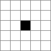
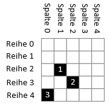
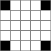
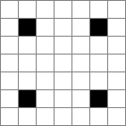
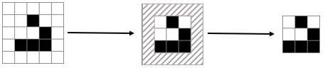
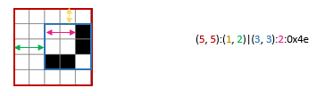
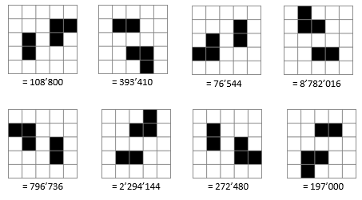

# Material und Methode

Um mich diesen grossen Fragen des "Game of Life" widmen zu können, programmierte ich als Erstes das einfache Grundkonzept des Spieles. Danach konzentrierte ich mich auf die Programmierung einer Simulation, die auf einem beliebig grossen Spielfeld alle möglichen und unterschiedlichen Konfiguration durchspielen sollte. Da ich mich lediglich in Python, (wenn auch nur dürftig), auskannte, wählte ich diese Programmiersprache für meine Arbeit. 
Mein Vater spielte eine grosse Rolle bei anfälligen Fragen oder als Anlaufstelle bei Unsicherheiten und Problemen. <!-- QUESTION: willst du das nochmals sagen? Du hast es ja schon im Vorwort gesagt.>

## Das Grundkonzept

Das Programmieren des Gameboards und der Spielfunktion stellte sich im Nachhinein als die kleinste aller Herausforderungen heraus. Dennoch beanspruchte dies viel Zeit, da ich eine Anfängerin im Programmieren war.   


### Das Gameboard

Das Gameboard erinnert an ein Schachbrett - wobei es keine schwarzen und weissen Felder gibt, sondern nur quadratische Häuschen. Im Programmiercode wird das Gameboard durch eine Matrix dargestellt. 

### Die Konfiguration

Die Konfiguration setzt sozusagen die lebenden Zellen auf das Gameboard. Dies wird mit einer binären Matrix programmiert. Die Zellen mit Nullen symbolisieren die toten Zellen und sind somit leer, die Zellen mit Einsen die lebenden. Diese werden schwarz ausgefüllt dargestellt. Somit sieht ein Gameboard mit einer einzelnen lebenden Zelle und der Grösse 5x5 wie folgt aus:


{width: "16.666666667%"}
  


### Spielzug (Play)

Als Nächstes machte ich mich an die Spielfunktion. Jede Zelle hat einen Index [Zeile, Spalte], ähnlich wie in einem Koordinatensystem. Die Nummerierung fängt bei null (wie in Pyhton üblich). In der Informatik gilt null gleich "False" und eins gleich "True". Eine Zelle muss also mit "True" gleichgesetzt werden, um als lebend zu gelten:


1. Zelle[2,1] = True
2. Zelle[3,2] = True
3. Zelle[4,0] = True


{width: "30%"}
  


Um eine Konfiguration nun durchspielen zu können, muss der Status der Nachbarzellen bekannt sein. Diesen finde ich durch einen Kernel heraus. 

{caption: "Kernel"}
```
[1, 1, 1]
[1, 0, 1]
[1, 1, 1]
```
Für jede Zelle wird dieser Kernel darüber gelegt, sodass das null auf der besagten Zelle liegt. Nun werden alle Zellen, auf denen eine Eins liegt, überprüft und zusammengezählt. Eine tote Zelle hat den Wert Null und eine lebende den Wert Eins. Sobald die Summe der Nachbarzellen nun bekannt ist, muss nur noch den Regeln gefolgt werden um den Status besagter Zelle für die nächste Generation herauszufinden.   
 
Diese Funktion wird in Pyhton in der Bibliothek `skipy` durch die Funktion `convolve` zur Verfügung gestellt.

{#randzellen}
### Randzellen

Ein Problem stellen die Ränder dar. Eine Zelle am Rand hat nur fünf existente Nachbarn. Eine Eckzelle sogar nur drei. 

Zuerst löste ich das Problem mit der sogenannten Kachelstrategie. Dabei werden die Gameboards auf allen acht Seiten (N, NE, E, SE, S, SW, W, NW) wiederholt. Beispielsweise hat die oberste Zelle links als linken (West-) Nachbarn die oberste Zelle rechts und umgekehrt.

Mit dem Hinblick auf die Simulation, die ich später erstellen würde, ist diese Lösung allerdings nicht die beste. Für die Simulation ist es nämlich wichtig, dass dieselben Bedingungen wie auf einem endlosen Spielbrett herrschen, da sonst die folgende Generation verfälscht werden könnte. Also schrieb ich eine Funktion, die jedes Mal, wenn eine Zelle am Rand des Gameboards ankommt, dieses um eine Reihe oder Spalte, je nach Fall, vergrössert. Somit ist sichergestellt, dass jede Zelle immer acht echte Nachbarn hat.
Zur Veranschaulichung nehmen wir folgendes Gameboard:


{width: "16.666667%"}
  

Bevor der nächste Spielzug errechnet wird, kommt auf jeder der vier Hauptseiten eine leere Zeile oder Spalte hinzu. Das Gameboard besitzt also nicht mehr die Grössenverhältnisse 5x5, sondern 7x7:


{width: "21%"}
  

Die Zellen sterben durch diese Funktion also bereits nach einer Generation aus. Für sie gelten nun dieselben Bedingungen wie für Zellen eines endlos grossen Spielfelds. 

 ## Simulation

Die Simulation ist der Schlüssel zur Beantwortung der Fragestellungen. 
Wenn alle möglichen Konfigurationen eines Spielfelds einmal durchgespielt werden, sind auch all deren Endzustände bekannt. Wenn nun also eine beliebige Konfiguration auf diesem begrenzten Spielfeld abgefragt wird, kann ich den Endzustand sozusagen "vorhersagen", ohne diese erneut durchzuspielen. Dabei handelt es sich nicht um einen echten Algorithmus, sondern eher um einen Katalog aller möglichen Konfigurationen.

Zudem sind mir die einzelnen Generationen jeder Konfiguration dieses Spielfeldes bekannt. Um herauszufinden, ob eine Konfiguration X aus einer Konfiguration Y entstehen kann, muss Konfiguration X also nur mit den abgespeicherten Generationen des Spiels vergleichen, das aus Konfiguration Y entsteht. 

### Endzustand

Als Erstes legte ich fest, nach welchen möglichen Endzuständen ich unterscheiden will. Ich entschied mich für die vier bekanntesten und nicht allzu seltenen Spielklassen:

1. Selbst auslöschende Objekte
1. Statische Objekte
1. Oszillierende Objekte
1. Gleitende Objekte

Zudem brauchte es noch eine weitere Objektgruppe, falls es sich um keines der obigen Objekte handelt, wie beispielsweise eine Gleiterkanone. Also fügte ich eine fünfte Möglichkeit hinzu, die alle restlichen Fälle abdeckt:

5. Überlebende Objekte

Für jede Generation des Spiels auf eine bestimmte Anfangskonfiguration muss nach jeder dieser Spielklasse geprüft werden. Sobald Spielklassen 1 - 4 identifiziert wurden, bricht das Spiel ab, und die Endkonfiguration wird festgehalten.

#### Selbst auslöschende Objekte (Erased)

Diese Objekte sind sichtlich einfach erkennbar. Eine Funktion prüft, ob in dem aktuellen Spielbrett lebende Zellen vorhanden sind. Falls nicht, zählt die Startkonfiguration zu den selbst auslöschenden Objekten. Falls lebende Zellen vorhanden sind, muss weiter geprüft werden. 

#### Statische Objekte (Stable)

Auch diese Objekte stellen kein Problem dar. Jede Konfiguration der vorherigen Generationen wird abgespeichert. Das letzte Objekt dieser Liste ist die Muttergeneration der aktuellen Konfiguration. Wenn diese beiden identisch sind, ist das Objekt statisch. Falls nicht, muss weiter geprüft werden.

#### Oszillierende Objekte (Oscillator)

Oszillatoren zeichnen sich dadurch aus, dass sie nach einer bestimmten Periode wieder dieselbe Konfiguration darstellen. Die aktuelle Generation muss nun also mit allen vorherigen Generation abgeglichen werden. Wenn keine Übereinstimmung vorhanden ist, muss weiter geprüft werden.

Ein Problem, das sich mir dabei stellte, war, dass ein oszillierendes Objekt grösser und dann wieder kleiner werden kann. Es kann also notwendig sein, das Gameboard zu erweitern, wie oben im Abschnitt (Randzellen)[#randzellen] beschrieben. Um jedoch zwei Generationen in einem Spiel vergleichen zu können, musste ich beim Zusammenziehen eines Objektes das Gameboard wieder auf die Grundform reduzieren.

#### Gleitende Objekte (Spaceship)

Durch die Reduktion auf die Grundform, die für oszillierende Objekte notwendig ist, ist es nicht einfach, die gleitenden Objekte von oszillierenden Objekten zu unterscheiden. Durch das Vereinfachen einer Konfiguration auf die Grundkonfiguration geht bei einem gleitenden Objekt die relative Position auf dem Gameboard verloren. Um dieses Problem zu lösen, musste ich zusätzlich zur Konfiguration noch die relative Position jeder Konfiguration in einem Spiel speichern und vergleichen. Bleibt die relative Position über Generationen hinweg gleich, so handelt es sich um ein oszillierendes Objekt. Ändert sich die relative Position, so handelt es sich um ein gleitendes Objekt.

Für das relative Gameboard müssen zuerst die leeren Spalten und Reihen bis zu den ersten lebenden Zellen herausgefunden werden. Damit nicht auch tote Zellen zwischen zwei lebendigen Zellen abgeschnitten werden, müssen die überflüssigen Reihen und Spalten von jeder Seite einzeln gezählt werden. Sobald diese Zahlen bekannt sind, kann bis zum Index der ersten lebenden Zelle abgeschnitten werden. 

<!-- TODO: das stimmt noch nicht ganz. Die Grundform brauchen wir für die Oszillatoren, die relative Position für die gleitenden Objekte. -->

  

Diese relativen Gameboards werden nun nach dem Schema der Oszillatoren abgeglichen und falls eine Affinität besteht, gilt diese Konfiguration als gleitendes Objekt.

#### Überlebende Objekte (Survival)

Falls der Objekttyp bis jetzt nicht identifiziert wurde, klassifizieren wir ein Spiel als überlebend. Damit diese Spiele nun nicht endlos weiterlaufen, baue ich eine maximale Zahl von erlaubten Spielzügen ein. Dieser Maximalwert impliziert eine Fehlerquote für Anfangskonfigurationen, die ein Objekt erst nach dem vorgegebenen Grenzwert erreichen. Würde dieser Grenzwert aber weggelassen werden, würde die Simulation endlos lange dauern. Den Grenzwert setzte ich bei meinen Simulationen auf 100.

### Speicherform des Spielbrettes 

Um die Spiele später analysieren zu können, wollte ich nicht alle Generationen, sondern nur die Anfangskonfiguration und den Endzustände abspeichern. Um eine Konfiguration in ein Excel schreiben zu können, muss die Konfiguration in ein Format gebracht werden, das sich dafür eignet. Eine Möglichkeit wäre, jede Konfiguration durch eine Reihe von Nullen und Einsen darzustellen. Dadurch würde viel zu viel Speicherplatz benötigt werden. Ausserdem wäre noch nicht klar, wie wir z.B. ein 4x5 Gameboard von einem 5x4 Gameboard unterscheiden. Also formattiere ich die Konfiguration nach folgendem Schema: 

1. Zuerst kommt die Grösse des Gameboards
2. Dann kommt die relative Position des Objekts auf dem Gameboard. 
3. Darauf folgt die eigentliche Grösse des Objekts (also der Grundform der Konfiguration).
4. Jetzt kommt die Anzahl an toten Zellen bis zur ersten lebendigen Zelle
5. Schlussendlich kommt noch die "Zahl" des Spielbrettes. Die Zahl des Spielbrettes ergibt sich aus dem Gameboard als binäre Zahl, die Nullen stellen die toten Zellen und die Einsen die lebendigen dar. Diese Zahl wird in eine hexadezimale Zahl umgewandelt, um weiteren Speicherplatz zu sparen. Somit erhält jedes Objekt eine individuelle Objektzahl. 
   
Das folgende Spielbrett sieht dann also wie folgt aus:

{width: "65%"}
  


### Zähler

Die soeben erklärte Methode der Objektzahl verwende ich auch, um die einzelnen zu simulierenden Anfangskonfigurationen zu generieren. Ein (dezimaler) Zähler zählt in einer `for` Schleife von 0 aufwärts. Einzig die höchste Zahl muss bekannt sein, also wie viele verschiedene Konfigurationen auf diesem Spielfeld maximal generiert werden können. Da hier eine Wahrscheinlichkeit mit zwei möglichen Ausgängen besteht (lebendig oder tot), liegt die Anzahl von unterschiedlichen Konfigurationen bei `2^{Anzahl Zellen}`$. Bei einem 5x5 Spielfeld gibt es also `2^{5\cdot5} = 33'554'432`$ Möglichkeiten. 

Nun zählt der Zähler hoch, bis diese Zahl erreicht wird. Jede Zahl wird zuerst in eine binäre Zahl umgewandelt. Diese wird nun mit dem leeren Spielfeld als binäre Zahl verglichen und von vorne (von links) mit Nullen aufgefüllt, bis sie auf die gleiche Länge kommen. Da die Länge und Breite des Spielbrettes bekannt sind, kann nun aus dieser binären Zahl einfach ein Spielbrett mit der gewünschten Konfiguration erstellt werden. 

TODO Zahlen entfernen an linkem Rand bei Leanpub
{title: "Dezimalzahl als Spielbrett", id: decimale_gb}
```text
Zahl:  Binärzahl:  Zellen:    Aufgefüllte Zahl:    Gameboard:
                                                   [False False False False False]
                                0000000000000      [False False False False False]
123     1111011    5*5 = 25     000001111011       [False False False False False]
                                                   [False False False  True  True]
                                                   [True  True  False  True  True]
          
```
### Aussortieren

Durch das Generieren der Anfangskonfigurationen durch den dezimalen Zähler entsteht das Problem, dass jede Konfiguration viel zu oft abgespielt wird, und zwar aus zwei Gründen:

1. Doppelgänger
2. affine Konfigurationen

#### Aussortieren von Doppelgängern

Das gleiche Objekt kann mehrfach auf einem Gameboard vorkommen, nämlich an einer anderen relativen Position. Dieses Problem ist relativ einfach zu lösen. In der Simulation werden immer nur Anfangskonfigurationen abgespielt, die der vorgegebenen Zielgrösse eines Gameboards *genau* entsprechen. Wenn ich also eine Simulation mit der vorgegebenen Grösse 5x5 starte, wird eine Anfangskonfiguration mit der relativen Grösse von 3x3 gar nicht abgespielt. So sind alle 3x3 Doppelgänger aussortiert. Wir dann die 3x3 Simulation durchgespielt, so gibt es keine 3x3-Doppelgänger mehr.

<!-- TODO: hier würde ich noch ein grafisches Beispiel einfügen. -->

#### Aussortieren von affinen Konfigurationen

Konfigurationen, die "ähnlich" sind, weil die eine durch Spiegelung oder Drehung in die andere transformiert werden kann, will ich ebenfalls nicht mehrfach spielen, da ich an *unterschiedlichen* Konfigurationen interessiert bin. Ich nenne diese Konfigurationen *affine Konfigurationen*. Siehe (Glossar)[#glossar].

Es werden alle nicht-affinen Anfangskonfigurationen in einem Set gespeichert. Jede neue Anfangskonfiguration wird mit allen vorherigen abgeglichen und falls eine Affinität gefunden wird, wird das Spiel nicht durchgeführt. 

<!-- TODO: klarer zwische Doppelgänger und affinen Konfigurationen unterscheiden -->

Trotz diesem Filter wird jede Anfangskonfiguration immer noch siebenmal zu oft abgespielt. Zur Veranschaulichung ein Beispiel. Die folgenden Konfigurationen sind eigentlich dieselben, nur entweder gedreht oder gespiegelt, deren dazugehörigen Dezimalzahlen allerdings komplett unterschiedlich:

{width: "70%"}
  

Um zu vermeiden, dass all diese abgespielt und gespeichert werden, muss also sowohl jede Anfangskonfiguration, als auch deren gespiegelten und gedrehten Variationen mit den bereits abgespielten Anfangskonfigurationen abgeglichen werden. Somit wird jede Konfiguration wirklich nur einmal abgespielt.

### Abspeichern

Ich speichere alle Spiele in ein CSV-File. <!-- TODO: ag Referenz einfügen --> Dieses Text-Format eignet sich besonders gut, da es einfach in eine Exceltabelle transformiert werden kann. 

Für das erste Problem, das Vorhersagen des Endzustandes, würde das Abspeichern jeder einzelnen Generation einer Konfiguration zu viel Speicherplatz brauchen. Deshalb werden diese hier auf die Anzahl an Generationen beschränkt. Die Anfangs- und Endlänge beziehungsweise -breite, die Anfangs- und Endkonfiguration und die Definition des Objektes werden auch abgespeichert. Zudem noch die Periodizität, falls es sich um ein oszillierendes oder gleitendes Objekt handelt. 

<!-- TODO: ag screenshot eines csvs in Excel einfügen -->

Für das zweite Problem, den Vergleich zweier Konfigurationen, werden alle Generationen jeder Konfiguration abgespeichert. Ansonsten wird nichts benötigt.


                                                                                      
                                                                                      
                                                                               
                                                                                                                                                                