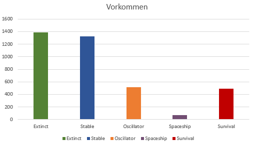

# Resultate

## Allgemeine Bemerkungen
Wenn alle gleichen, also gespiegelten und verschobenen, Konfigurationen aussortiert werden, kommen auf einem 4x4 Spielfeld 3785 verschiedene Konfigurationen raus. Laut meinem Programm sind löschen sich die meisten davon aus oder werden stabil. Am seltesten erscheinen gleitende Objekte. 
{width: "60%"}
 

Wenig überraschend ist auch, dass die "überlebenden" Konfigurationen die grösste maximale Breite und Weite haben. 
