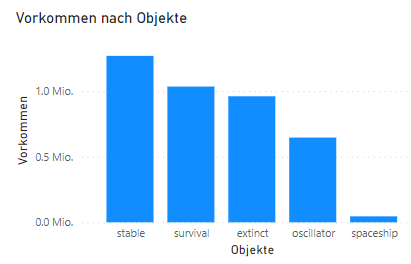
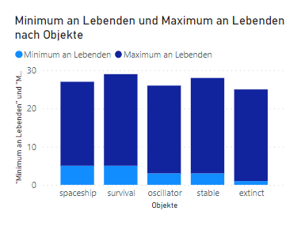

# Resultate

## Allgemeine Resultate

Die Simulation speichert nur die Konfigurationen ab, die zuvor noch nicht in anderer Form abgespielt wurden, also an anderer Position oder gespiegelt. Ich konnte die Simulation bis zu einem 5x5 grossen Gameboard abspielen lassen. Die 6x6 Simulation würde zu einer 68,7 Milliarden Konfigurationen führen, was mit meinen technischen Mitteln und der mir zur Verfügung stehenden Zeit nicht simulierbar gewesen wäre. Auch die 5x5 Simulation konnte überhaupt nur durch parallele Prozesse, unterteilt nach genauer Grösse des Gameboards und Anzahl aller lebenden Zelle in der Anfangskonfiguration, abgespielt werden. 

Von 33'554'432 theoretisch möglichen Konfigurationen bei einem 5x5 Gameboard wurden durch Ausschluss von Doppelgängern und affinen Konfigurationen 3'956'995 unterschiedliche Anfangskonfigurationen identifiziert und abgespeichert. Das sind also knapp 12 % der theoretisch möglichen Konfigurationen. Der am längsten dauernde Prozess mit den meisten unterschiedlichen Konfigurationen war die 5x5 Simulation mit 13 lebenden Zellen in der Anfangskonfiguration. Diese Simulation dauerte auf einem handelsüblichen Notebook etwa sechs Stunden. 

{width: "60%"}
   

Am häufigsten kommen statische und selbst auslöschende Spiele vor. Überlebende Spiele kommen am zweithäufigsten vor. Gleitende Spiele sind mit Abstand am seltensten. 

Auch stellte sich heraus, dass die meisten oszillierenden Objekte eine Periodizität von 2 haben. Mit einer Periodizität von drei existieren 5474 oszillierende Objekte, mit 15 wurden nur noch 14 entdeckt. Diese 14 Anfangskonfiguration sind alle unterschiedlich, entwickeln sich jedoch alle zu dem genau gleichen Objekt. All diese Anfangskonfigurationen haben zwischen 12 und 16 lebenden Zellen. 
Gleitende Objekte haben alle eine Periodizität von 4. Dies deckt sich mit dem gegenwärtigen wissenschaftlichen Stand, wonach es keine bekannte gleitende Objekte mit Periodizität ungleich 4 gibt.

{width: "60%"}
  

Des Weiteren fand ich heraus, dass auf keinem Gameboard ein gleitendes Objekt entstehen kann, wenn die Startkonfiguration weniger als fünf lebende Zellen hat. Mit mehr als 22 lebenden Zellen kann auf einem 5x5 Gameboard ebenfalls kein gleitendes Objekt entstehen. Ein oszillierendes oder statisches Objekt kann bereits bei drei lebenden Zellen entstehen, letzteres sogar, wenn das gesamte 5x5 Gameboard nur aus lebenden Zellen besteht.     

## Aufgabenbezogene Resultate

Das erste Problem, das meine Arbeit untersucht, lautete:

> Es existiert kein Algorithmus, der bestimmen kann, zu welchem Objekt die Anfangskonfiguration mutieren wird.

Dieses Problem kann nun eine Funktion umgehen, indem sie die gegebene Konfiguration mit den getesteten Anfangskonfigurationen abgleicht. Sobald eine Übereinstimmung gefunden wird, ist bekannt, welcher Spielklasse die Konfiguration angehört.

Das zweite Problem lautete:

> Es existiert kein Algorithmus, der für alle Konfigurationen bestimmen kann, ob die eine aus der anderen entstehen wird.

Dieses Problem kann ebenfalls eine Funktion umgehen, indem sie die zu vergleichende Konfiguration mit den getesteten Anfangskonfigurationen abgleicht. Sobald eine Affinität gefunden wird, gleicht sie die zu vergleichende Konfiguration mit den Generationen der übereinstimmenden Anfangskonfiguration ab. Falls hierbei eine Affinität gefunden wird, kann die zu testende Konfiguration aus der zu vergleichenden Konfiguration entstehen, ansonsten nicht.   

